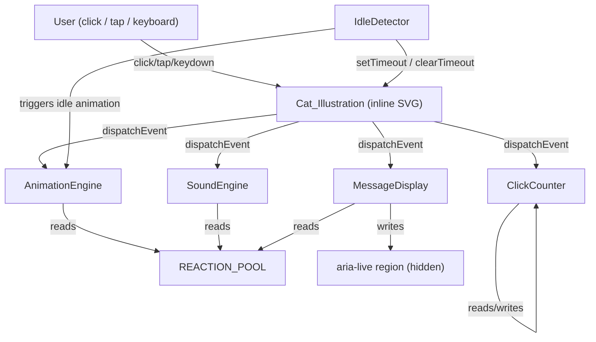

# Design Document

## Cat Clicker App

---

## Overview

Cat Clicker App is a self-contained, single-file (`index.html`) browser application. A user sees a minimalist inline SVG cat in the centre of the page; clicking or tapping the cat triggers a randomised *Reaction*—an animation, an optional sound, and a message. The app tracks a per-session click counter, handles idle animations when the user is inactive, and meets WCAG 2.1 Level AA accessibility requirements.

**Technical charter**

| Constraint | Detail |
|---|---|
| Delivery unit | Single `index.html` (markup + inline `<style>` + inline `<script>`) |
| CSS framework | Tailwind CSS via official CDN `<script>` tag only |
| JavaScript | Vanilla ES2022, no frameworks, no build tools |
| Browser targets | Latest stable Chrome, Firefox, Safari, Edge |
| Responsive range | 320 px – 2560 px (no horizontal scrollbar) |
| Audio | Web Audio API preferred; `<audio>` HTMLElement as fallback; muted by default |
| Motion | `prefers-reduced-motion` respected throughout |
| Accessibility | Keyboard nav, `aria-label`, `aria-live="polite"`, WCAG 2.1 AA |

---

## Architecture

The app is a single HTML page. All logic lives in one inline `<script>` block structured as ES2022 module-style objects/classes (no `type="module"` needed — everything is in the same scope). Tailwind CDN provides utility classes; a small `<style>` block handles custom keyframe animations and any overrides Tailwind cannot express.

### High-level component diagram



### Data flow for a single click

```
User click
  └─► Cat_Illustration (click handler)
        ├─► ClickCounter.increment()
        ├─► AnimationEngine.triggerReaction(reaction)
        │       └─► picks reaction from REACTION_POOL
        │       └─► applies CSS animation class to SVG
        ├─► SoundEngine.play(reaction)
        │       └─► plays audio clip (if not muted)
        ├─► MessageDisplay.show(reaction.message)
        │       └─► updates #message-text
        │       └─► updates aria-live region
        └─► IdleDetector.reset()
```

### Module responsibilities

| Module | Responsibility |
|---|---|
| `REACTION_POOL` | Immutable array of Reaction objects; validated at boot |
| `AnimationEngine` | Uniform-random selection with no-3-consecutive rule; applies/restarts CSS animation |
| `SoundEngine` | Loads audio clips; respects mute state; Web Audio API → HTMLAudioElement fallback |
| `MessageDisplay` | Renders reaction/idle/milestone messages; truncates at 80 chars; updates aria-live |
| `ClickCounter` | Tracks session count; fires milestone events at 10, 25, 50, 100, +100 |
| `IdleDetector` | setTimeout-based; cycles through idle animations; cancels on click |

---

## Components and Interfaces

### REACTION_POOL

```js
// Defined as a const array — read-only at runtime
const REACTION_POOL = [
  {
    id: 'purr',          // unique string id
    animationClass: 'anim-purr',  // CSS class added to SVG
    durationMs: 800,     // 400–2000 ms
    message: 'Purrrr…',  // ≤ 280 chars; truncated to 80 in MessageDisplay
    audioClip: 'purr',   // key into SoundEngine clip map
    category: 'happy',
  },
  // … at least 8 reactions covering: happy/purr, surprised, sleepy/yawn,
  //   heart-eyes, booping-nose, plus extras to reach ≥ 8
];
```

Validation runs at `DOMContentLoaded`. Any reaction with `durationMs` outside 400–2000 ms is removed and a `console.warn` is emitted.

---

### AnimationEngine

```js
const AnimationEngine = {
  _lastReactionIds: [],   // circular buffer of the last 3 picks

  /**
   * Pick a reaction, ensuring no 3 consecutive duplicates.
   * Falls back to a different reaction if the pool has ≥ 2 entries.
   * @returns {Reaction | null}
   */
  pickReaction() { … },

  /**
   * Apply the animation CSS class to the SVG element.
   * If an animation is already running, remove the class first (force reflow),
   * then re-add it — this restarts the animation per Req 3.4.
   * @param {Reaction} reaction
   */
  triggerReaction(reaction) { … },

  /**
   * Apply an idle animation CSS class to the SVG.
   * @param {string} animationClass
   */
  triggerIdle(animationClass) { … },

  /**
   * Remove any active animation class from the SVG.
   */
  clearAnimation() { … },
};
```

**No-3-consecutive algorithm**: maintain a ring buffer of the last 3 `id` values picked. Before confirming a pick, check if all 3 are identical; if so, filter the pool and re-pick uniformly from the remainder.

**Pool exhaustion / shuffle**: track a `_played` Set. When its size equals `REACTION_POOL.length`, Fisher-Yates shuffle a working copy of the pool; ensure the first item after shuffle differs from the last played.

**Restart animation** (Req 3.4): remove the class → trigger a synchronous reflow (`void el.offsetWidth`) → re-add the class.

---

### SoundEngine

```js
const SoundEngine = {
  _muted: true,           // default muted (Req 5.6)
  _clips: {},             // { [clipKey]: AudioBuffer | HTMLAudioElement }
  _audioCtx: null,        // AudioContext (lazily created)

  /** @returns {boolean} */
  get muted() { return this._muted; },

  /** Load all clips at boot */
  async loadClips() { … },

  /**
   * Play the clip for the given reaction (no-op if muted or clip unavailable).
   * @param {Reaction} reaction
   */
  play(reaction) { … },

  /** Stop all playing audio within 100 ms. */
  stopAll() { … },

  toggleMute() { … },
};
```

**Capability detection order**:
1. `window.AudioContext || window.webkitAudioContext` → Web Audio API path (AudioBuffer + `createBufferSource`)
2. `document.createElement('audio').canPlayType` → HTMLAudioElement fallback
3. Neither → silent degradation; `_clips` stays empty

**Autoplay policy**: `AudioContext` is created lazily on the first user gesture, not at page load.

---

### MessageDisplay

```js
const MessageDisplay = {
  _el: null,              // #message-text DOM element
  _ariaEl: null,          // #aria-live DOM element (visually hidden)
  IDLE_MSG: 'Click the cat to pet it!',   // ≤ 80 chars

  init(msgEl, ariaEl) { … },

  /**
   * Show a reaction or milestone message.
   * Truncates to 80 chars + ellipsis if needed (Req 7.6).
   * Updates aria-live region within 100 ms (Req 9.4).
   * @param {string} text
   */
  show(text) { … },

  /** Show the idle prompt. */
  showIdle() { … },
};
```

---

### ClickCounter

```js
const ClickCounter = {
  _count: 0,
  _el: null,              // counter DOM element
  MILESTONES: [10, 25, 50, 100],   // plus every +100 after

  init(el) { … },

  /**
   * Increment count, update DOM within one animation frame (≤ 16 ms),
   * and fire a milestone callback if applicable.
   * @param {(milestone: number) => void} onMilestone
   */
  increment(onMilestone) { … },

  /** Reset to 0 (page reload, not called programmatically). */
  reset() { … },
};
```

**Milestone logic**: after increment, check if `_count` is in `MILESTONES` or `(_count > 100 && _count % 100 === 0)`.

---

### IdleDetector

```js
const IdleDetector = {
  IDLE_THRESHOLD_MS: 10_000,
  IDLE_ANIMATIONS: [
    { animationClass: 'anim-tail-wag', durationMs: 4000 },
    { animationClass: 'anim-slow-blink', durationMs: 5000 },
  ],
  _timer: null,
  _cycleIndex: 0,
  _cycling: false,

  /** Start the inactivity countdown. */
  start() { … },

  /** Reset the inactivity timer (called on every click). */
  reset() { … },

  /** Begin cycling through idle animations. */
  _beginCycle() { … },

  /** Stop idle cycling and clear animation (called on user click). */
  cancel() { … },
};
```

---

### DOM Structure

```html
<body class="min-h-screen flex flex-col items-center justify-center bg-[#fdf6ee]">

  <!-- Visually-hidden aria-live region -->
  <div id="aria-live" aria-live="polite" aria-atomic="true"
       class="sr-only"></div>

  <!-- Mute toggle -->
  <button id="mute-toggle" aria-label="Toggle sound" aria-pressed="true"
          class="absolute top-4 right-4 …">🔇</button>

  <!-- Message display -->
  <p id="message-text" role="status"
     class="text-center text-lg font-medium text-gray-700 mb-4 min-h-[1.5em]">
    Click the cat to pet it!
  </p>

  <!-- Cat illustration -->
  <div id="cat-wrapper"
       tabindex="0"
       role="img"
       aria-label="Pet the cat"
       class="cursor-pointer focus:outline-none focus:ring-4 focus:ring-pink-400
              focus:ring-offset-2 rounded-full select-none">
    <!-- inline SVG -->
    <svg id="cat-svg" width="300" height="300" viewBox="0 0 300 300" …>
      …
    </svg>
  </div>

  <!-- Click counter -->
  <p id="counter-display"
     class="mt-6 text-gray-500 text-sm">
    <span id="counter-value">0</span> pets
  </p>

  <!-- Milestone message (hidden until triggered) -->
  <div id="milestone-msg" aria-live="assertive"
       class="hidden mt-3 text-pink-600 font-semibold text-base">
  </div>

</body>
```

---

## Data Models

### Reaction

```ts
interface Reaction {
  id: string;            // unique identifier, ≤ 100 chars (Req 4.1)
  animationClass: string; // CSS class name for keyframe
  durationMs: number;    // 400–2000 ms (Req 4.3)
  message: string;       // ≤ 280 chars raw; truncated to 80 in display (Req 4.3 / 7.6)
  audioClip: string;     // key into SoundEngine._clips; '' = no sound
  category: ReactionCategory;
}

type ReactionCategory =
  | 'happy'       // purr / happy  (Req 4.4)
  | 'surprised'   // startled      (Req 4.4)
  | 'sleepy'      // yawn          (Req 4.4)
  | 'heart-eyes'  //               (Req 4.4)
  | 'boop'        // booping nose  (Req 4.4)
  | 'extra';      // additional reactions to reach minimum 8
```

### IdleAnimation

```ts
interface IdleAnimation {
  animationClass: string;
  durationMs: number;   // 3000–8000 ms (Req 8.2)
}
```

### AppState (runtime, in-memory only)

```ts
interface AppState {
  clickCount: number;       // session total
  muted: boolean;           // audio mute state (default true)
  currentReaction: Reaction | null;
  isIdling: boolean;
  milestoneTimerId: number | null;
}
```

State is never persisted (Req 6.5 — counter resets on reload). No `localStorage` is used.

### Minimum Reaction Pool (8 reactions)

| id | category | message |
|---|---|---|
| `purr` | happy | "Purrrr… you have warm hands 🐾" |
| `surprised` | surprised | "!!! What was that?! 😱" |
| `yawn` | sleepy | "Mmmnyaawwn… five more minutes 😴" |
| `heart-eyes` | heart-eyes | "You're my favourite hooman 💕" |
| `boop` | boop | "Boop! The snoot has been booped 🐱" |
| `flop` | extra | "Flopping over for maximum pets 🙃" |
| `chirp` | extra | "Chirp chirp! There's a bird! 🐦" |
| `knead` | extra | "Making biscuits… do not disturb 🍞" |

---

## Correctness Properties

*A property is a characteristic or behavior that should hold true across all valid executions of a system — essentially, a formal statement about what the system should do. Properties serve as the bridge between human-readable specifications and machine-verifiable correctness guarantees.*

---

### Property 1: Counter increment is always exactly +1

*For any* non-negative integer starting count, calling `ClickCounter.increment()` once must yield a count of exactly `start + 1`.

**Validates: Requirements 3.1**

---

### Property 2: No reaction is chosen four or more times consecutively

*For any* reaction pool of two or more reactions and any number of sequential calls to `AnimationEngine.pickReaction()`, no single reaction `id` appears four or more times in a row in the resulting sequence.

**Validates: Requirements 4.2**

---

### Property 3: Post-exhaustion first pick differs from pre-exhaustion last pick

*For any* reaction pool of two or more reactions, after every reaction in the pool has been picked at least once (exhaustion), the next reaction selected must have a different `id` than the last reaction selected before exhaustion.

**Validates: Requirements 4.5**

---

### Property 4: Duration validation filters out-of-range reactions

*For any* array of reaction definitions that contains some reactions with `durationMs` outside the range [400, 2000], the validated pool produced at boot must contain only reactions where `400 ≤ durationMs ≤ 2000`; every out-of-range reaction must be absent.

**Validates: Requirements 4.6**

---

### Property 5: Milestone detection is correct for all non-negative counts

*For any* non-negative integer count, `isMilestone(count)` must return `true` if and only if count ∈ {10, 25, 50} or (count ≥ 100 and count % 100 === 0), and `false` for all other values.

**Validates: Requirements 6.4**

---

### Property 6: MessageDisplay syncs truncated text to visible element and aria-live region

*For any* string `msg`, after `MessageDisplay.show(msg)` is called:

- if `msg.length > 80`, the text content of both the visible message element and the `aria-live` region must equal `msg.slice(0, 80) + '…'`;
- if `msg.length ≤ 80`, both elements must contain `msg` verbatim.

**Validates: Requirements 7.6, 9.4**

---

## Error Handling

### Boot-time validation errors

| Error | Behaviour |
|---|---|
| Reaction `durationMs` out of range | Remove reaction, emit `console.warn('Reaction <id> skipped: invalid durationMs <n>')` |
| Reaction pool empty after validation | AnimationEngine no-ops; ClickCounter is not incremented; no message or animation shown (Req 3.7) |
| Cat SVG fails to load (`` fallback path) | Render a `<div>` placeholder of 200×200 px with `alt="Cat illustration"` (Req 2.6) |

### Runtime audio errors

| Error | Behaviour |
|---|---|
| `AudioContext` unavailable | Silently fall back to `HTMLAudioElement` (Req 5.5) |
| `HTMLAudioElement` unavailable | Silent degradation — no sound, no error displayed (Req 5.5) |
| Audio clip `fetch` / decode fails | `SoundEngine._clips[key]` remains `null`; `play()` is a no-op; no error shown (Req 5.7) |
| Audio clip unavailable at play time | Silent skip (Req 5.7) |

### Runtime animation errors

| Error | Behaviour |
|---|---|
| Animation CSS class not found | The browser simply applies no visual effect; counter and message still update |
| Reaction animation interrupted by re-click | Remove class, force reflow (`void el.offsetWidth`), re-add class (Req 3.4) |

### Tailwind CDN unavailable

The `<style>` block inside `index.html` includes fallback rules for layout (centering, min/max widths, cursor, focus ring) so the page remains structurally usable (Req 1.7).

### Keyboard / accessibility errors

| Error | Behaviour |
|---|---|
| `cat-wrapper` fails to receive focus | Ensure `tabindex="0"` is set in HTML; if removed by dynamic code, restore via `setAttribute('tabindex','0')` on `DOMContentLoaded` (Req 9.6) |

---

## Testing Strategy

### Scope

Because the app ships as a single `index.html` with no build step, automated tests run against the **extracted pure-logic functions** copied into a testable module, plus DOM-level integration tests using jsdom or a browser test harness (e.g. Playwright component testing).

### Testing layers

| Layer | Tool | What it covers |
|---|---|---|
| Property-based unit tests | **fast-check** (loaded via CDN in test HTML, or via npm in a sibling `__tests__` folder) | The 6 correctness properties above |
| Example-based unit tests | Native `console.assert` / `node:test` or Vitest | Specific edge cases, empty-pool guard, uniform-pick spot checks |
| DOM integration tests | Playwright or jsdom | Click → counter update, animation class applied, message visible, aria-live populated, mute toggle, keyboard nav |
| Accessibility audit | axe-core + manual screen-reader test | WCAG 2.1 AA, focus indicator, `aria-label`, `aria-live` |
| Responsive smoke test | Playwright viewport resize | 320 px, 768 px, 1440 px, 2560 px — no horizontal scrollbar |

### Property-based test configuration (fast-check)

Each property test runs a minimum of **100 iterations** (fast-check default; set `numRuns: 100` explicitly).

Tag format in test comments: `// Feature: cat-clicker-app, Property <N>: <property_text>`

| Property | Test input generators |
|---|---|
| P1 — counter +1 | `fc.integer({ min: 0, max: 1_000_000 })` for starting count |
| P2 — no-3-consecutive | `fc.array(fc.record({id: fc.string(), …}), {minLength: 2, maxLength: 20})` for pool; `fc.integer({min: 10, max: 500})` for N picks |
| P3 — post-exhaustion first≠last | Same pool generator; simulate exhaustion by picking until `_played.size === pool.length` |
| P4 — duration validation | `fc.array(fc.record({durationMs: fc.integer({min: 0, max: 3000}), …}))` with mix of valid and invalid |
| P5 — milestone detection | `fc.integer({ min: 0, max: 10_000 })` for count |
| P6 — message display sync | `fc.string({ minLength: 0, maxLength: 300 })` for message |

### Unit test focus areas

- **Empty pool guard** (Req 3.7): pool = `[]`, click → counter unchanged, no class applied
- **Restart animation** (Req 3.4): two rapid calls to `triggerReaction` → animation class present only once after both calls
- **Mute toggle** (Req 5.3): toggle twice → state returns to original; `SoundEngine.muted` reflects button `aria-pressed`
- **Idle timer cancel** (Req 8.3): click fires → `IdleDetector.cancel()` called within 100 ms
- **Milestone message replace** (Req 6.4): reach milestone 10 → message shown; before 3 s reach milestone 25 → message replaced and timer reset

### Dual-testing rationale

Unit/property tests verify the **pure logic layer** (reaction selection, counter math, truncation, validation). DOM integration tests verify the **wiring** (event handlers attached, classes applied, DOM updated, aria-live populated). This split keeps property tests fast and deterministic while integration tests confirm end-to-end behaviour.
